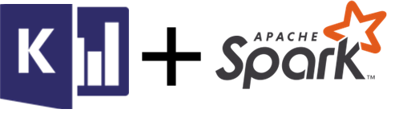

<p align="center">
  
</p>

# Azure Data Explorer Connector for Apache Spark

master: [](https://msazure.visualstudio.com/One/_build/latest?definitionId=58677)
 
This library contains the source code for Azure Data Explorer Data Source and Data Sink Connector for Apache Spark.

Azure Data Explorer (A.K.A. [Kusto](https://azure.microsoft.com/en-us/services/data-explorer/)) is a lightning-fast indexing and querying service. 

[Spark](https://spark.apache.org/) is a unified analytics engine for large-scale data processing.

Making Azure Data Explorer and Spark work together enables building fast and scalable applications, targeting a variety of Machine Learning, Extract-Transform-Load, Log Analytics and other data driven scenarios. 

## Changelog

For main changes from previous releases please refer to [Releases](https://github.com/Azure/azure-kusto-spark/releases).
For known or new issues please refer to the [issues](https://github.com/Azure/azure-kusto-spark/issues) section.

## Usage

### Linking 

Starting version 2.3.0 we introduce new artifact Ids: `kusto-spark_3.x_2.12` targeting Spark 3.x and Scala 2.12 
and `kusto-spark_2.4_2.11` targeting Spark 2.4.x and scala 2.11.
For Scala/Java applications using Maven project definitions, 
link your application with the artifact below in order to use the Azure Data Explorer connector for Spark. 
> Note: Versions prior to 2.5.1  do not work anymore for ingest to an existing table, please update to the latest.

```
groupId = com.microsoft.azure.kusto
artifactId = kusto-spark_3.0_2.12
version = 2.9.1
```

**In Maven**:

Look for the following coordinates: 
```
com.microsoft.azure.kusto:kusto-spark_3.0_2.12:2.9.1
```

Or clone this repository and build it locally to add it to your local maven repository, 
the jar can also be found under the [released package](https://github.com/Azure/azure-kusto-spark/releases)

 ```
   <dependency>
     <groupId>com.microsoft.azure.kusto</groupId>
     <artifactId>spark-kusto-connector</artifactId>
     <version>2.9.1</version>
   </dependency>
```

**In Databricks**:

Libraries -> Install New -> Maven -> copy the following coordinates:

```
com.microsoft.azure.kusto:kusto-spark_3.0_2.12:2.9.1
```

#### Building Samples Module
Samples are packaged as a separate module with the following artifact

```xml
<artifactId>connector-samples</artifactId>
```    

In order to build the whole project comprised of the connector module and the samples module, 
use the following artifact:

```xml
<artifactId>azure-kusto-spark</artifactId>
```

## Build Prerequisites

In order to use the connector, you need to have:

- Java 1.8 SDK installed
- [Maven 3.x](https://maven.apache.org/download.cgi) installed
- Spark - with the respective version as the reflected by the artifact Id (either 2.4 or 3.0)

> Note: when working with 2.3 Spark version or lower, build the jar locally from branch 2.4 and 
simply change the spark version in the pom file. 

## Build Commands
   
```
// Builds jar and runs all tests
mvn clean package

// Builds jar, runs all tests, and installs jar to your local maven repository
mvn clean install
```

## Pre-Compiled Libraries
In order to facilitate ramp-up from local jar on platforms such as Azure Databricks, pre-compiled libraries
are published under [GitHub Releases](https://github.com/Azure/azure-kusto-spark/releases).
These libraries include:
* Azure Data Explorer connector library
* User may also need to include Kusto Java SDK libraries (kusto-data and kusto-ingest), which are published under
[GitHub Releases](https://github.com/Azure/azure-kusto-java/releases)

## Dependencies
Spark Azure Data Explorer connector takes dependency on [Azure Data Explorer Data Client Library](https://mvnrepository.com/artifact/com.microsoft.azure.kusto/kusto-data) 
and [Azure Data Explorer Ingest Client Library](https://mvnrepository.com/artifact/com.microsoft.azure.kusto/kusto-ingest), 
available on maven repository.
When [Key Vault based authentication](./docs/Authentication.md) is used, there is an additional dependency 
on [Microsoft Azure SDK For Key Vault](https://mvnrepository.com/artifact/com.microsoft.azure/azure-keyvault). 

> **Note:** When working with JARs , Azure Data Explorer connector requires Azure Data Explorer java client libraries (and azure key-vault library if used) to be installed.
To find the right version to install [look in the relevant release's pom](https://github.com/Azure/azure-kusto-spark/releases))

## Documentation

Detailed documentation can be found [here](docs).

## Samples

Usage examples can be found [here](samples/src/main/scala)

# Available Azure Data Explorer client libraries:

Here is a list of currently available client libraries for Azure Data Explorer:
- [Node](https://github.com/azure/azure-kusto-node)
- [Python](https://github.com/azure/azure-kusto-python)
- [.NET](https://docs.microsoft.com/en-us/azure/kusto/api/netfx/about-the-sdk)
- [Java](https://github.com/azure/azure-kusto-java)
   
For the comfort of the user, here is a [Pyspark sample](./samples/src/main/python/pyKusto.py) for the connector.

# Need Support?

- **Have a feature request for SDKs?** Please post it on [User Voice](https://feedback.azure.com/forums/915733-azure-data-explorer) to help us prioritize
- **Have a technical question?** Ask on [Stack Overflow with tag "azure-data-explorer"](https://stackoverflow.com/questions/tagged/azure-data-explorer)
- **Need Support?** Every customer with an active Azure subscription has access to [support](https://docs.microsoft.com/en-us/azure/azure-supportability/how-to-create-azure-support-request) with guaranteed response time.  Consider submitting a ticket and get assistance from Microsoft support team
- **Found a bug?** Please help us fix it by thoroughly documenting it and [filing an issue](https://github.com/Azure/azure-kusto-spark/issues/new).

# Contributing

This project welcomes contributions and suggestions.  Most contributions require you to agree to a
Contributor License Agreement (CLA) declaring that you have the right to, and actually do, grant us
the rights to use your contribution. For details, visit https://cla.microsoft.com.

When you submit a pull request, a CLA-bot will automatically determine whether you need to provide
a CLA and decorate the PR appropriately (e.g., label, comment). Simply follow the instructions
provided by the bot. You will only need to do this once across all repos using our CLA.

This project has adopted the [Microsoft Open Source Code of Conduct](https://opensource.microsoft.com/codeofconduct/).
For more information see the [Code of Conduct FAQ](https://opensource.microsoft.com/codeofconduct/faq/) or
contact [opencode@microsoft.com](mailto:opencode@microsoft.com) with any additional questions or comments.
