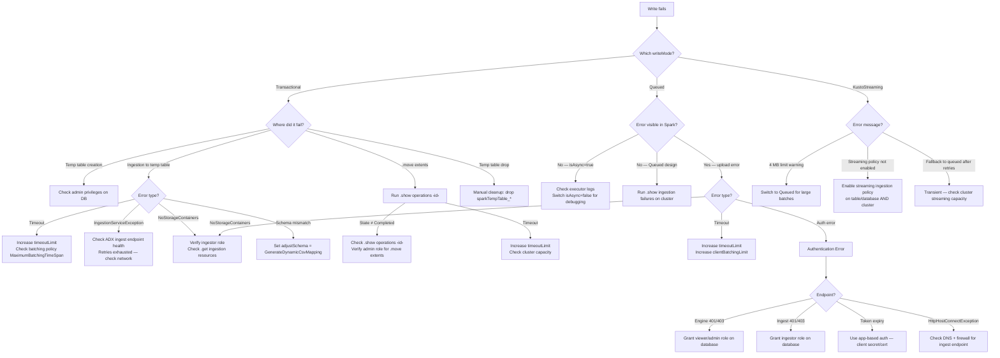
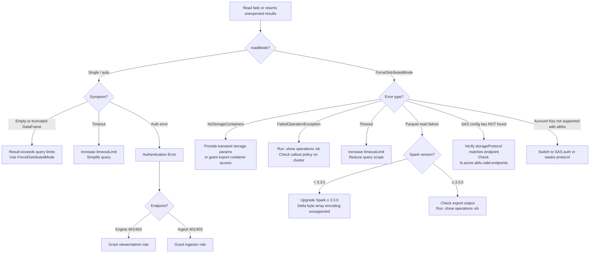
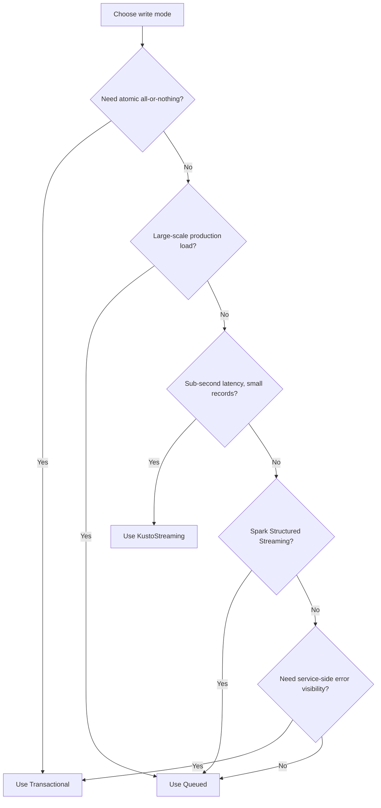

# Azure Data Explorer Spark Connector — Troubleshooting Flowcharts

## Write Path Triage

```mermaid
flowchart TD
    A[Write fails] --> B{Which writeMode?}
    B -->|Transactional| C{Where did it fail?}
    B -->|Queued| D{Error visible in Spark?}
    B -->|KustoStreaming| E{Error message?}

    C -->|Temp table creation| C1[Check admin privileges on DB]
    C -->|Ingestion to temp table| C2{Error type?}
    C -->|.move extents| C3[Run .show operations ‹id›]
    C -->|Temp table drop| C4[Manual cleanup: drop sparkTempTable_*]

    C2 -->|Timeout| C2a[Increase timeoutLimit\nCheck batching policy MaximumBatchingTimeSpan]
    C2 -->|IngestionServiceException| C2b[Check ADX ingest endpoint health\nRetries exhausted — check network]
    C2 -->|NoStorageContainers| C2c[Verify ingestor role\nCheck .get ingestion resources]
    C2 -->|Schema mismatch| C2d[Set adjustSchema = GenerateDynamicCsvMapping]

    C3 -->|State ≠ Completed| C3a[Check .show operations ‹id›\nVerify admin role for .move extents]
    C3 -->|Timeout| C3b[Increase timeoutLimit\nCheck cluster capacity]

    D -->|No — isAsync=true| D1[Check executor logs\nSwitch isAsync=false for debugging]
    D -->|No — Queued design| D2[Run .show ingestion failures on cluster]
    D -->|Yes — upload error| D3{Error type?}

    D3 -->|Timeout| D3a[Increase timeoutLimit\nIncrease clientBatchingLimit]
    D3 -->|NoStorageContainers| C2c
    D3 -->|Auth error| AUTH

    E -->|4 MB limit warning| E1[Switch to Queued for large batches]
    E -->|Streaming policy not enabled| E2[Enable streaming ingestion policy\non table/database AND cluster]
    E -->|Fallback to queued after retries| E3[Transient — check cluster streaming capacity]

    AUTH[Authentication Error] --> AUTH1{Endpoint?}
    AUTH1 -->|Engine 401/403| AUTH2[Grant viewer/admin role on database]
    AUTH1 -->|Ingest 401/403| AUTH3[Grant ingestor role on database]
    AUTH1 -->|Token expiry| AUTH4[Use app-based auth — client secret/cert]
    AUTH1 -->|HttpHostConnectException| AUTH5[Check DNS + firewall for ingest endpoint]
```

## Read Path Triage

```mermaid
flowchart TD
    R[Read fails or returns unexpected results] --> R1{readMode?}

    R1 -->|Single / auto| R2{Symptom?}
    R1 -->|ForceDistributedMode| R3{Error type?}

    R2 -->|Empty or truncated DataFrame| R2a[Result exceeds query limits\nUse ForceDistributedMode]
    R2 -->|Timeout| R2b[Increase timeoutLimit\nSimplify query]
    R2 -->|Auth error| AUTH

    R3 -->|NoStorageContainers| R3a[Provide transient storage params\nor grant export container access]
    R3 -->|FailedOperationException| R3b[Run .show operations ‹id›\nCheck callout policy on cluster]
    R3 -->|Timeout| R3c[Increase timeoutLimit\nReduce query scope]
    R3 -->|Parquet read failure| R3d{Spark version?}

    R3d -->|< 3.3.0| R3e[Upgrade Spark ≥ 3.3.0\nDelta byte array encoding unsupported]
    R3d -->|≥ 3.3.0| R3f[Check export output\nRun .show operations ‹id›]

    R3 -->|SAS config key NOT found| R3g[Verify storageProtocol matches endpoint\nCheck fs.azure.abfs.valid.endpoints]
    R3 -->|Account Key not supported with abfss| R3h[Switch to SAS auth or wasbs protocol]

    AUTH[Authentication Error] --> AUTH1{Endpoint?}
    AUTH1 -->|Engine 401/403| AUTH2[Grant viewer/admin role]
    AUTH1 -->|Ingest 401/403| AUTH3[Grant ingestor role]
```

## Write Mode Decision

```mermaid
flowchart TD
    START[Choose write mode] --> Q1{Need atomic all-or-nothing?}
    Q1 -->|Yes| TRANSACTIONAL[Use Transactional]
    Q1 -->|No| Q2{Large-scale production load?}
    Q2 -->|Yes| QUEUED[Use Queued]
    Q2 -->|No| Q3{Sub-second latency, small records?}
    Q3 -->|Yes| STREAMING[Use KustoStreaming]
    Q3 -->|No| Q4{Spark Structured Streaming?}
    Q4 -->|Yes| QUEUED
    Q4 -->|No| Q5{Need service-side error visibility?}
    Q5 -->|Yes| TRANSACTIONAL
    Q5 -->|No| QUEUED
```

